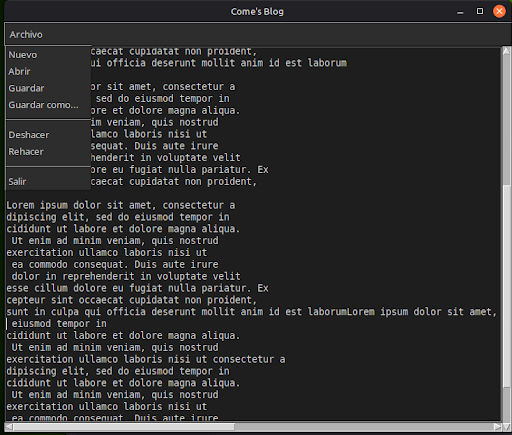

# Come's Blog 📝

Un editor de texto simple y elegante con tema oscuro, construido con Python y Tkinter.



## Características ✨

- 🎨 Tema oscuro moderno
- 💾 Guardar y abrir archivos
- ⌨️ Atajos de teclado (Ctrl+S, Ctrl+O, Ctrl+N)
- ↩️ Deshacer/Rehacer
- 📜 Scroll horizontal y vertical
- 🖼️ Icono personalizado

## Requisitos 📋

- Python 3.6 o superior (viene con Tkinter preinstalado)
- Linux (probado en Linux mint)

## Instalación 🚀

### Método 1: Instalación automática (recomendado)
```bash
# Clonar el repositorio
git clone https://github.com/tu-usuario/come-blog.git
cd come-blog

# Ejecutar el script de instalación
chmod +x install.sh
./install.sh
```

Esto instalará la aplicación en `~/.local/bin` y creará un launcher en tu menú de aplicaciones.

### Método 2: Ejecutar desde el código fuente
```bash
# Clonar el repositorio
git clone https://github.com/tu-usuario/come-blog.git
cd come-blog

# Ejecutar directamente
python3 textEditor.py
```

## Uso 💡

### Desde el menú de aplicaciones
Busca "Come's Blog" en tu launcher de aplicaciones.

### Desde la terminal
```bash
come-blog
```

### Atajos de teclado

| Atajo | Acción |
|-------|--------|
| `Ctrl + N` | Nuevo archivo |
| `Ctrl + O` | Abrir archivo |
| `Ctrl + S` | Guardar archivo |
| `Ctrl + Z` | Deshacer |
| `Ctrl + P` | Rehacer |

## Desinstalación 🗑️
```bash
chmod +x uninstall.sh
./uninstall.sh
```

## Desarrollo 🛠️

### Compilar manualmente con PyInstaller
```bash
# Instalar PyInstaller
pip install pyinstaller

# Compilar
pyinstaller --onefile --windowed --icon=odin.ico --add-data="odin.png:." textEditor.py
```

El ejecutable estará en `dist/textEditor`

## Estructura del proyecto 📁
```
come-blog/
├── textEditor.py      # Código principal
├── odin.png          # Icono PNG
├── odin.ico          # Icono ICO
├── install.sh        # Script de instalación
├── uninstall.sh      # Script de desinstalación
└── README.md         # Este archivo
```

## Licencia 📄

Este proyecto está bajo la Licencia MIT - ver el archivo [LICENSE](LICENSE) para más detalles.

## Autor ✒️

[MarcosRFlores](https://github.com/MarcosRFlores)

## Agradecimientos 🙏

- Inspirado en editores de texto minimalistas
- Icono de mi gato Odin (Come) bello